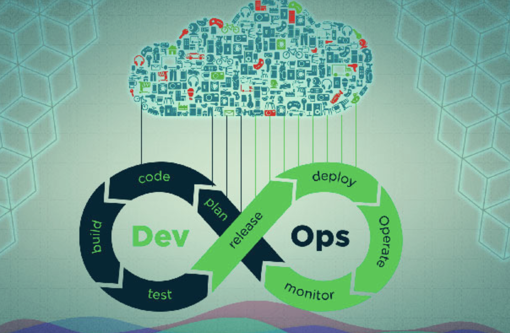

参考：https://juejin.cn/post/6960978516825341988

ci
: plan-> code -> build -> test （迭代 如环)

cd
: realease -> deploy -> operate -> monitor （迭代 如环）

ci =>> cd （迭代 如环）

图如：

每个步骤都可能伴随着 artifacts（工件）的产生

是一个过程的管道

管道需要各种服务支持

公共的目录可用来存放中间产物 或者阶段中所需资源

docker-swarm 支持跨主机通讯

docker 创建overlay网络类型 也可以协助跨主机通讯

## Drone

Drone 的强大功能之一是服务的概念。有时，执行特定任务（例如：集成测试）需要支持服务，例如 redis 实例或 postgres 实例。任何使用 SaaS 服务的人都需要使用 docker-in-docker (dind) 功能。使用 Drone，您只需定义一个服务

## kv存储

可以在容器中配置这些公共的服务ip 来共享数据

kv存储器 可选的比较多
如 consul etcd