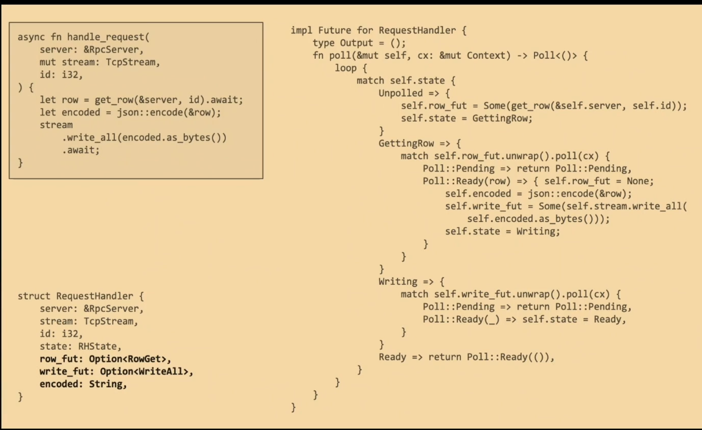

# Future

## 

在其他语言中对应的就是 Promise 。rust中代表了一段将被一部执行的计算。

比如你是黑社会的 放贷给了别人 那么借款单就是这个Future了 。
特点是 它是惰性的 你不要（poling 上门追债去）借钱的人不会给你反馈（还钱 还是祈求宽限另一个日子  假设你是借钱的人 那么对方拿借条催债了 你的行为就是 还完OK啦 或者还一部分 要求宽限一段时间 下次来催债你依旧有两种决策 ...）

借条的组合
借条可以由若干其他借条组成 ，那么催债时就好玩了。
可以按借款的时间顺序 一个个催 上一个完了再进行下一个，或者同时进行多笔欠款都同时催收一遍。
借条的整体状态（钱还完了 还是没完 ）取决于子借条的状态 类似进度条那样的 。 借条的这种组合性可以递归下去。

## 

真实的 Future 特征有何不同之处。

trait Future {
    type Output;
    fn poll(
        // 首先值得注意的地方是，`self`的类型从`&mut self`变成了`Pin<&mut Self>`:
        self: Pin<&mut Self>,
        // 其次将`wake: fn()` 修改为 `cx: &mut Context<'_>`:
        cx: &mut Context<'_>,
    ) -> Poll<Self::Output>;
}

首先这里多了一个 Pin ，关于它我们会在后面章节详细介绍，现在你只需要知道使用它可以创建一个无法被移动的 Future ，因为无法被移动，因此它将具有固定的内存地址，意味着我们可以存储它的指针(如果内存地址可能会变动，那存储指针地址将毫无意义！)，也意味着可以实现一个自引用数据结构: struct MyFut { a: i32, ptr_to_a: *const i32 }。 而对于 async/await 来说，Pin 是不可或缺的关键特性。

其次，从 wake: fn() 变成了 &mut Context<'_> 。意味着 wake 函数可以携带数据了，为何要携带数据？考虑一个真实世界的场景，一个复杂应用例如web服务器可能有数千连接同时在线，那么同时就有数千 Future 在被同时管理着，如果不能携带数据，当一个 Future 调用 wake 后，执行器该如何知道是哪个 Future 调用了 wake ,然后进一步去 poll 对应的 Future ？没有办法！那之前的例子为啥就可以使用没有携带数据的 wake ？ 因为足够简单，不存在歧义性。

总之，在正式场景要进行 wake ，就必须携带上数据。 而 Context 类型通过提供一个 Waker 类型的值，就可以用来唤醒特定的的任务。

## Rust 异步函数的一生
[async/await 是如何工作的，以及它对性能的影响？](https://www.youtube.com/watch?v=ZHP9sUqB3Qs)

上面图就是类似借条组合 一个Future内部 有其他异步操作时 整体状态就会多出一个来 整体poll时会挨个poll子future的 每个子future执行完了 会在尾部把整体状态置为下个要催收的状态。 直到Ready 结束返回。

## 不错的资料
- [rust inside](https://github.com/Warrenren/inside-rust-std-library/blob/main/21-RUST%E7%9A%84%E5%BC%82%E6%AD%A5%E7%BC%96%E7%A8%8B.md)
